# ⚡ Circuit Breaker in Software Architecture

The **Circuit Breaker pattern** is a resilience strategy used in distributed systems and microservices to prevent cascading failures when a service or dependency is unavailable or slow. It’s inspired by electrical circuit breakers that cut power when a fault occurs.

---

## 🔑 Core Idea
- When a service call repeatedly fails (e.g., due to downtime, network issues, or overload), the circuit breaker "opens."
- Once open, further calls are **blocked immediately** instead of wasting resources on doomed requests.
- After a cooldown period, the breaker allows a few "test" requests to see if the service has recovered.
- If successful, the breaker "closes" again, restoring normal traffic.

---

## 🛠 States of a Circuit Breaker
| State        | Behavior                                                                 |
|--------------|--------------------------------------------------------------------------|
| **Closed**   | Normal operation. Requests flow through. Failures are counted.           |
| **Open**     | Requests are blocked instantly. Prevents further strain on failing service. |
| **Half-Open**| Allows limited test requests. If they succeed, breaker closes; if not, it reopens. |

---

## 📊 Benefits
- **Fail fast**: Avoids waiting on timeouts for every request.
- **Resource protection**: Prevents threads, memory, and CPU from being consumed by repeated failures.
- **Graceful degradation**: Enables fallback logic (e.g., cached data, default responses).
- **System stability**: Stops one failing service from dragging down the entire system.

---

## 🧩 Example in Microservices
Imagine a payment service calling a third-party credit check API:
- If the API is down, repeated calls would timeout and slow the payment service.
- With a circuit breaker:
  - After N failures, the breaker opens.
  - Payment service immediately returns a fallback response (e.g., "Credit check unavailable, try later").
  - After a cooldown, it retries a few calls to see if the API is back.

---

## 🔍 Comparison with Retry Pattern
- **Retry**: Keeps trying until success or max attempts. Good for transient failures.
- **Circuit Breaker**: Stops trying after repeated failures. Good for persistent failures.

Often, they’re **combined**: retry a few times, then trip the breaker if failures persist.

---

## 📐 Circuit Breaker Visuals

### State Transitions

```mermaid
stateDiagram-v2
  direction LR
  [*] --> Closed
  Closed : Normal operations<br/>Count failures
  Closed --> Open : Failure rate ≥ threshold<br/>or consecutive failures ≥ N
  Closed --> Closed : Success
  Open : Short-circuit requests<br/>Fail fast + fallback
  Open --> HalfOpen : After timeout (cooldown)
  HalfOpen : Allow limited trial requests
  HalfOpen --> Closed : Trial successes ≥ M
  HalfOpen --> Open : Any trial failure
```

### Request Flow with Fallback

---

Tip: Combine retries with the circuit breaker by retrying a small number of times inside the Closed state before counting a failure toward the threshold.

