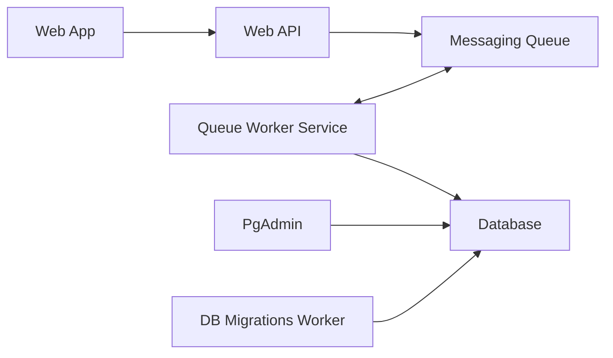

---

1. Create Aspire project

1. Add Host Integrations to AppHost project

1. Create known remaining projects

1. Orchestrate in AppHost

1. Add Client Integrations projects

1. Make sure they are all in the same solution


dotnet add package Aspire.Hosting.PostgreSQL
### Setup Entity Framework
1. Install tool
2. Add EF nuget packages
3. Create models (classes that represent tables)
4. Create DbContext
    - inherit from DbContext
    - constructor - pass options to base
    - DbSet<Model> for each model
    - OnModelCreating(ModelBuilder modelBuilder) for seeding database
5. Create Migrations      -   dotnet ef migrations add InitialCreate
6. Apply Migrations       -   dotnet ef database update

Add tool/packages to support Code First ORM
```bash
dotnet tool install --global dotnet-ef

dotnet add package Microsoft.EntityFrameworkCore
dotnet add package Microsoft.EntityFrameworkCore.Design
dotnet add package Microsoft.EntityFrameworkCore.Relational
dotnet add package Microsoft.EntityFrameworkCore.Tools

dotnet add package Aspire.Npgsql.EntityFrameworkCore.PostgreSQL
```

Register DB context for Dependency Injection
```c#
builder.AddNpgsqlDbContext<AppDbContext>(connectionName: "postgresdb");
```

Connection Name should match logical DB name provided in AppHost
*************************************************************
var builder = DistributedApplication.CreateBuilder(args);

var postgres = builder.AddPostgres("postgres");
var postgresdb = postgres.AddDatabase("postgresdb");

var exampleProject = builder.AddProject<Projects.ExampleProject>()
                            .WithReference(postgresdb);
							
***************************************************************