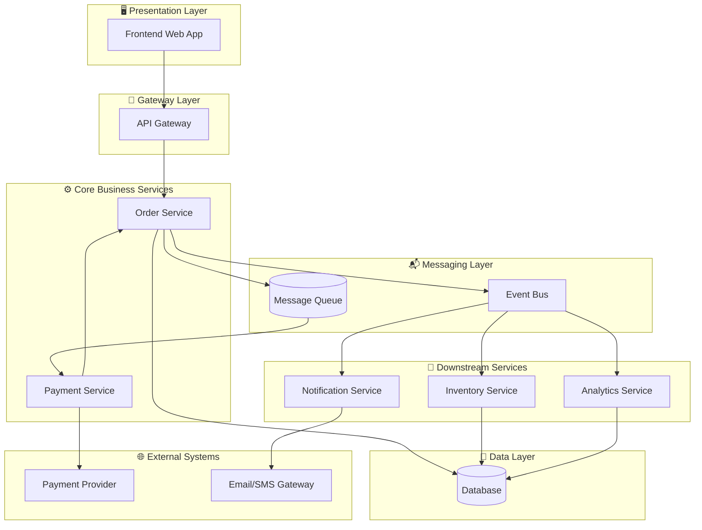

# Order Processing Pipeline Diagrams

---

## 🧠 Logical Architecture Diagram

The **logical view** shows the conceptual components and their relationships, independent of physical deployment. It focuses on *what* the system does.

---