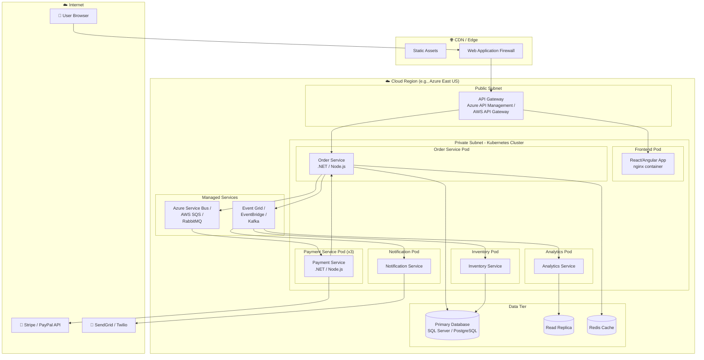

## 🏗️ Physical Architecture Diagram

The **physical view** shows how components are deployed across infrastructure, including cloud resources, containers, and network boundaries.

```mermaid
flowchart TB
    subgraph Internet["☁️ Internet"]
        User[👤 User Browser]
        ExtPP[🏦 Stripe / PayPal API]
        ExtEmail[📧 SendGrid / Twilio]
    end

    subgraph CDN["🌐 CDN / Edge"]
        StaticAssets[Static Assets]
        WAF[Web Application Firewall]
    end

    subgraph CloudRegion["☁️ Cloud Region (e.g., Azure East US)"]
        
        subgraph PublicSubnet["Public Subnet"]
            APIGW[API Gateway<br/>Azure API Management /<br/>AWS API Gateway]
        end

        subgraph PrivateSubnet["Private Subnet - Kubernetes Cluster"]
            subgraph FrontendPod["Frontend Pod"]
                FEContainer[React/Angular App<br/>nginx container]
            end
            
            
            subgraph OrderPod["Order Service Pod"]
                OSContainer[Order Service<br/>.NET / Node.js]
            end

            subgraph PaymentPod["Payment Service Pod (x3)"]
                PSContainer[Payment Service<br/>.NET / Node.js]
            end

            subgraph NotificationPod["Notification Pod"]
                NSContainer[Notification Service]
            end

            subgraph InventoryPod["Inventory Pod"]
                ISContainer[Inventory Service]
            end

            subgraph AnalyticsPod["Analytics Pod"]
                ASContainer[Analytics Service]
            end
        end

        subgraph ManagedServices["Managed Services"]
            Queue[Azure Service Bus /<br/>AWS SQS /<br/>RabbitMQ]
            EventGrid[Event Grid /<br/>EventBridge /<br/>Kafka]
        end

        subgraph DataTier["Data Tier"]
            PrimaryDB[(Primary Database<br/>SQL Server / PostgreSQL)]
            ReadReplica[(Read Replica)]
            Cache[(Redis Cache)]
        end
    end

    User --> WAF
    WAF --> APIGW
    APIGW --> FEContainer
    APIGW --> OSContainer
    OSContainer --> PrimaryDB
    OSContainer --> Cache
    OSContainer --> Queue
    Queue --> PSContainer
    PSContainer --> ExtPP
    PSContainer --> OSContainer
    OSContainer --> EventGrid
    EventGrid --> NSContainer
    EventGrid --> ISContainer
    EventGrid --> ASContainer
    NSContainer --> ExtEmail
    ISContainer --> PrimaryDB
    ASContainer --> ReadReplica
```

