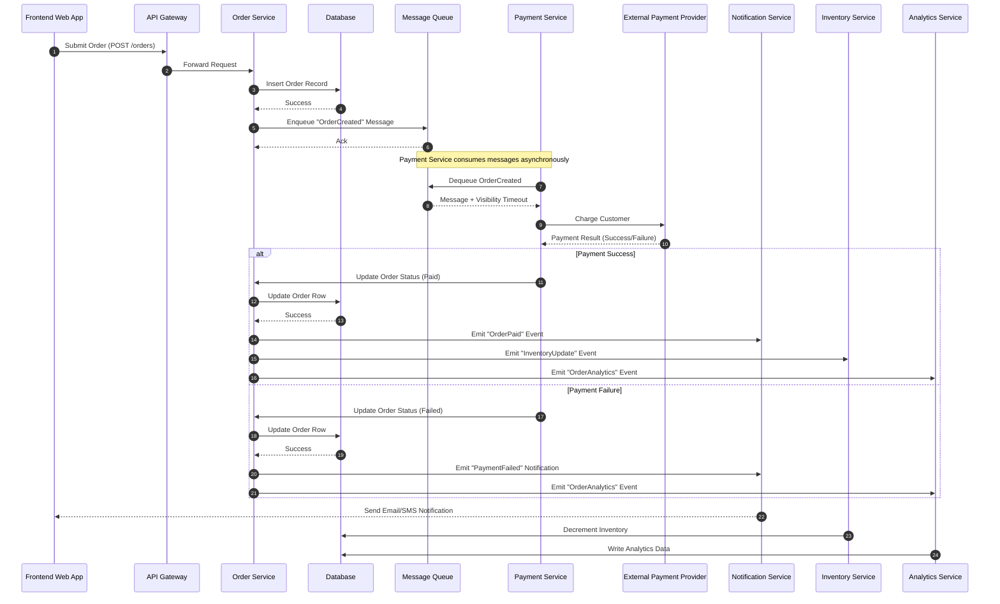

# Order Processing Pipeline Diagrams

## 🔄 Sequence Diagram

The sequence diagram below shows the temporal flow of messages between components.

```mermaid
sequenceDiagram
    autonumber

    participant FE as Frontend Web App
    participant GW as API Gateway
    participant OS as Order Service
    participant DB as Database
    participant Q as Message Queue
    participant PS as Payment Service
    participant PP as External Payment Provider
    participant NS as Notification Service
    participant IS as Inventory Service
    participant AS as Analytics Service

    FE->>GW: Submit Order (POST /orders)
    GW->>OS: Forward Request
    OS->>DB: Insert Order Record
    DB-->>OS: Success


    OS->>Q: Enqueue "OrderCreated" Message
    Q-->>OS: Ack

    Note over Q,PS: Payment Service consumes messages asynchronously

    PS->>Q: Dequeue OrderCreated
    Q-->>PS: Message + Visibility Timeout

    PS->>PP: Charge Customer
    PP-->>PS: Payment Result (Success/Failure)

    alt Payment Success
        PS->>OS: Update Order Status (Paid)
        OS->>DB: Update Order Row
        DB-->>OS: Success

        OS->>NS: Emit "OrderPaid" Event
        OS->>IS: Emit "InventoryUpdate" Event
        OS->>AS: Emit "OrderAnalytics" Event
    else Payment Failure
        PS->>OS: Update Order Status (Failed)
        OS->>DB: Update Order Row
        DB-->>OS: Success

        OS->>NS: Emit "PaymentFailed" Notification
        OS->>AS: Emit "OrderAnalytics" Event
    end

    NS-->>FE: Send Email/SMS Notification
    IS->>DB: Decrement Inventory
    AS->>DB: Write Analytics Data


```